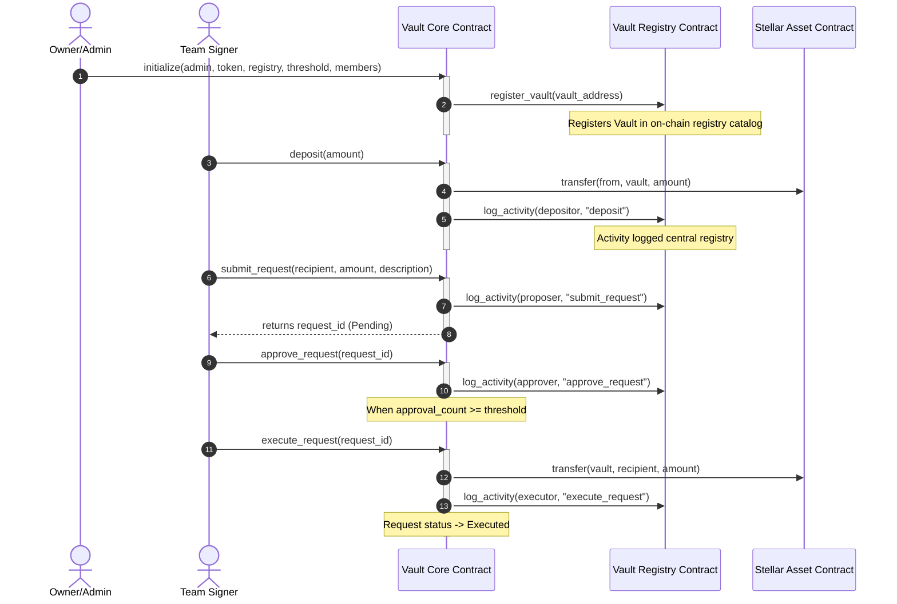

# 🔐 VaultLink

VaultLink is a premium, secure, and production-ready **multi-signature treasury dashboard** powered by **Stellar Soroban smart contracts**. It enforces threshold-based signing protocols for decentralized team fund management, real-time activity tracking, and registry catalogs.

This repository is fully compliant with **Level 3 Smart Contract & Web Application Developer specifications**, featuring advanced on-chain programming, inter-contract messages, real-time sync engines, comprehensive test suites, Docker hosting setups, and automated CI/CD pipelines.

### 🌐 Live Demo

🔗 **Live App:** [https://treasury-guard.vercel.app](https://treasury-guard.vercel.app/)

---

## 🏗️ Architecture Design & Flows

VaultLink employs a decoupled multi-contract architecture to optimize upgradability, access governance, and indexing:

1. **Vault Registry Contract (`vault_registry`)**: Acts as a central catalog. It keeps record of all active vaults, accumulates transaction volumes, logs core activities, and can be upgraded securely by the administrator.
2. **Vault Core Contract (`vault_core`)**: Manages the treasury funds (using Stellar Asset Contracts - SAC). It holds USDC reserves, accepts deposits, registers multi-sig members, manages pending spending proposals, gathers threshold approvals, and executes withdrawals upon reaching the required signers limit.

### Inter-Contract Communication Flow

On-chain operations require the Vault Core contract to message the Vault Registry contract. The sequence diagram below maps this workflow:



---

## 🏆 Level 3 Compliance Checklist

| Requirement | Implementation Details | Status |
| :--- | :--- | :---: |
| **Advanced smart contract development** | Implemented Rust Soroban contract with custom structs (`SpendingRequest`), persistent storage keys, panic-safe error handling, and WASM upgrade interfaces (`update_current_contract_wasm`). | **Completed** |
| **Inter-contract communication** | Vault Core imports `RegistryInterface` and executes inter-contract calls via `RegistryClient` to register itself and log structured transaction metadata in real-time. | **Completed** |
| **Event streaming & real-time updates** | Next.js polls Soroban RPC event logs (`getEvents`) every 10s on Testnet. Sandbox mode simulates background signers activity using a `setInterval` simulator, pushing alerts to the dashboard. | **Completed** |
| **CI/CD pipeline setup** | Created GitHub Actions workflow `.github/workflows/ci.yml` that builds and runs unit tests for both Rust smart contracts and TypeScript Next.js web application. | **Completed** |
| **Smart contract deployment workflow** | Added cross-platform deployment bash scripts (`deploy.sh`, `upgrade.sh`) mirroring Windows PowerShell scripts (`deploy.ps1`, `upgrade.ps1`) to compile and deploy on Testnet. | **Completed** |
| **Mobile responsive frontend** | Fully responsive Tailwind layout supporting custom dark palettes, hover micro-animations (`glass-panel-hover`), and dynamic layout shifts for mobile views. | **Completed** |
| **Error handling & loading states** | Implemented inputs validation (Stellar address regex, balance checks) and button state loaders with disabling attributes (`loadingAction` state machine). | **Completed** |
| **Writing tests for contracts and frontend** | Rust smart contracts are tested using native mocking utilities in `lib.rs`. Next.js frontend has complete test coverage using `Vitest` and `jsdom` testing engine. | **Completed** |
| **Production-ready architecture** | Dockerized the Next.js app with multi-stage build optimization (`Dockerfile`) and configured orchestrator scripts (`docker-compose.yml`) for local scaling. | **Completed** |
| **Documentation & presentation** | Created a comprehensive root architecture diagram (Mermaid), API descriptions, local execution parameters, and requirements mappings. | **Completed** |

---

## 🔗 Deployed Contracts (Stellar Testnet)

All contracts are deployed on **Stellar Testnet**. Addresses are auto-loaded from `frontend/src/config/contracts.json`.

| Contract | Address |
| :--- | :--- |
| **Vault Core** | `CAE76V4RTBOADDXZGQZOOHIJZKTLWEI6MSUL5DM3UHVJ5MHALVON6MGW` |
| **Vault Registry** | `CBQKUWSNFURGUV5LYPMMOK3YOWWPUUI2N6LSXIKQS3H745I2R7W5CMQU` |
| **SAC Token (USDC)** | `CDT3PKODYDZDCDXJLO3PZ56GARG5SIDCDEEDTU7EBGPW3EITKCOWQOXW` |

> **Admin/Owner address:** `GACYFFEF6TV4MNCRW5LYZ57PO6V3CAVZMGYBEHD4MG6IPYVXENE4XJQO`

---

## 📸 Screenshots

### Wallet Selector (Multi-Wallet Support)


### Mobile Responsive UI

<!-- TODO: Capture screenshot of mobile layout.
     Steps:
       1. Open the app in Chrome
       2. Press F12 → open DevTools
       3. Click the device toggle icon (top-left of DevTools, looks like a phone/tablet)
       4. Select "iPhone 14 Pro" (393×852) or "Pixel 7" (412×915) from the device dropdown
       5. Refresh the page — the layout should stack vertically
       6. Screenshot the full page showing stacked cards and mobile-friendly navigation
       7. Save as public/mobile-responsive.png and uncomment the line below
-->
<!--  -->

### CI/CD Pipeline (GitHub Actions)

<!-- TODO: Capture screenshot of a passing CI run.
     Steps:
       1. Push code to GitHub (already done)
       2. Go to https://github.com/vishvajitbhagave-dev/TreasuryGuard/actions
       3. Click on the most recent workflow run (should show green checkmarks)
       4. Screenshot the full page showing both jobs passing:
          - "Smart Contracts" (Rust build + cargo test) — green ✓
          - "Frontend" (npm lint + npm test + npm build) — green ✓
       5. Save as public/ci-pipeline.png and uncomment the line below
-->
<!--  -->

### Test Output

<!-- TODO: Capture screenshot of passing tests.
     Run this command in the frontend/ directory:
       cd frontend && npm run test
     The output should show 11 passing tests. Screenshot the terminal output.
     Then run in the project root:
       cargo test --manifest-path contracts/Cargo.toml
     The output should show 3 passing tests. Screenshot that too.
     Save as public/test-output.png and uncomment the line below
-->
<!--  -->

---

## 🔗 Verified Transactions

All transactions below are live on **Stellar Testnet** and verifiable on [Stellar Expert](https://stellar.expert/explorer/testnet).

- [Vault Core Initialize TX](https://stellar.expert/explorer/testnet/tx/efeb0af4f07db267c428cb5a01cd91d360d69a5a9ad760ffba1b3c4abf444a05) — contract call initializing Vault Core with admin, USDC token, registry, signing threshold and member list (Aug 7, 2026)
- [Vault Registry Initialize TX](https://stellar.expert/explorer/testnet/tx/bc7943b753a4e5cd1b47b0af057005c55fc4b82abde675b172a34ec993cfd4ed) — contract call initializing the Vault Registry admin (Aug 7, 2026)

---

## 🎬 Demo Video

<!-- TODO: Record a 1–2 minute screen recording covering:
     0:00–0:10  — Intro: show the landing page, explain it's a multi-sig vault on Stellar
     0:10–0:25  — Connect Wallet: click Connect, show multi-wallet dropdown, connect with Freighter
     0:25–0:40  — Dashboard overview: show vault balance, token balance, stat cards
     0:40–0:55  — Deposit: enter amount, click Deposit, show spinner → success notification with tx hash
     0:55–1:10  — Submit Proposal: fill recipient/amount/description, submit, show it appear in the Requests list
     1:10–1:25  — Approve & Execute: click Approve (show threshold update), click Execute (show final tx)
     1:25–1:40  — Real-time events: point out the Activity Log updating live
     1:40–2:00  — Wrap up: show network toggle (Simulation ↔ Testnet), mobile responsive view

     Record with OBS Studio (free) or use https://screenrec.com for browser recording.
     Upload to YouTube (unlisted) or Loom, then paste the link below.
-->
🔗 **Demo Video:** _Recording pending — [record with Loom](https://loom.com) or OBS Studio_

---

## 🚀 Getting Started

### Prerequisites

Ensure you have the following installed:
- [Rust](https://www.rust-lang.org/) & `wasm32-unknown-unknown` target.
- [Node.js v20+](https://nodejs.org/).
- [Stellar CLI](https://developers.stellar.org/docs/build/smart-contracts/getting-started/setup) (for contract deployments).

---

### 1. Clone the Repository

```bash
git clone https://github.com/vishvajitbhagave-dev/TreasuryGuard.git
cd TreasuryGuard
```

---

### 2. Environment Variables

No `.env` file is required for local development. All configuration is handled through:

- **Smart contracts**: Deployed contract addresses are auto-generated into `frontend/src/config/contracts.json` by the deployment scripts.
- **Network**: The app defaults to Simulation mode. Switch to Stellar Testnet via the toggle in the header — no RPC URL configuration needed.

If you deploy your own contracts, the deploy scripts automatically update `frontend/src/config/contracts.json`.

---

### 3. Smart Contract Development & Testing

The contracts live in the `/contracts` directory.

- **Compile Contracts**:
  ```bash
  cd contracts
  stellar contract build
  ```

- **Run Smart Contract Unit Tests**:
  ```bash
  cargo test --manifest-path Cargo.toml
  ```

---

### 4. Frontend Development & Testing

The dashboard is built using Next.js 16/React 19 and Tailwind CSS.

- **Install Frontend Dependencies**:
  ```bash
  cd frontend
  npm install
  ```

- **Run Dev Server Locally**:
  ```bash
  npm run dev
  ```
  Access the dashboard at `http://localhost:3000`.

- **Run Frontend Unit Tests**:
  ```bash
  npm run test
  ```
  Runs 11 test cases across the simulation state manager and component structures.

---

### 5. Deploying & Upgrading Contracts

Deployment configuration is saved automatically to the frontend (`frontend/src/config/contracts.json`).

- **Deploy (macOS/Linux/Bash)**:
  ```bash
  ./scripts/deploy.sh --network testnet --source default
  ```

- **Deploy (Windows/PowerShell)**:
  ```powershell
  .\scripts\deploy.ps1 -Network testnet -Source default
  ```

- **Upgrade (macOS/Linux/Bash)**:
  ```bash
  ./scripts/upgrade.sh --contract-id <CONTRACT_ID> --wasm <WASM_PATH> --network testnet
  ```

- **Upgrade (Windows/PowerShell)**:
  ```powershell
  .\scripts\upgrade.ps1 -ContractId <CONTRACT_ID> -WasmPath <WASM_PATH> -Network testnet
  ```

---

### 6. Running with Docker (Production Ready)

To build and run the Next.js application inside a lightweight optimized production Docker container:

- **Build and Run**:
  ```bash
  docker-compose up --build
  ```
  This maps the optimized container port to `http://localhost:3000`.

- **Stop Container**:
  ```bash
  docker-compose down
  ```
