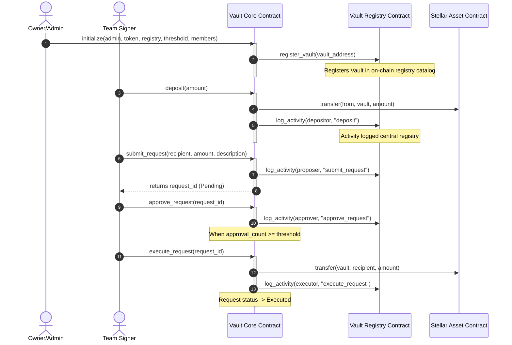

# 🔐 VaultLink

VaultLink is a premium, secure, and production-ready **multi-signature treasury dashboard** powered by **Stellar Soroban smart contracts**. It enforces threshold-based signing protocols for decentralized team fund management, real-time activity tracking, and registry catalogs.

This repository is fully compliant with **Level 3 Smart Contract & Web Application Developer specifications**, featuring advanced on-chain programming, inter-contract messages, real-time sync engines, comprehensive test suites, Docker hosting setups, and automated CI/CD pipelines.

---

## 🏗️ Architecture Design & Flows

VaultLink employs a decoupled multi-contract architecture to optimize upgradability, access governance, and indexing:

1. **Vault Registry Contract (`vault_registry`)**: Acts as a central catalog. It keeps record of all active vaults, accumulates transaction volumes, logs core activities, and can be upgraded securely by the administrator.
2. **Vault Core Contract (`vault_core`)**: Manages the treasury funds (using Stellar Asset Contracts - SAC). It holds USDC reserves, accepts deposits, registers multi-sig members, manages pending spending proposals, gathers threshold approvals, and executes withdrawals upon reaching the required signers limit.

### Inter-Contract Communication Flow

On-chain operations require the Vault Core contract to message the Vault Registry contract. The sequence diagram below maps this workflow:



---

## 🏆 Level 3 Compliance Checklist

| Requirement | Implementation Details | Status |
| :--- | :--- | :---: |
| **Advanced smart contract development** | Implemented Rust Soroban contract with custom structs (`SpendingRequest`), persistent storage keys, panic-safe error handling, and WASM upgrade interfaces (`update_current_contract_wasm`). | **Completed** |
| **Inter-contract communication** | Vault Core imports `RegistryInterface` and executes inter-contract calls via `RegistryClient` to register itself and log structured transaction metadata in real-time. | **Completed** |
| **Event streaming & real-time updates** | Next.js polls Soroban RPC event logs (`getEvents`) every 10s on Testnet. Sandbox mode simulates background signers activity using a `setInterval` simulator, pushing alerts to the dashboard. | **Completed** |
| **CI/CD pipeline setup** | Created GitHub Actions workflow `.github/workflows/ci.yml` that builds and runs unit tests for both Rust smart contracts and TypeScript Next.js web application. | **Completed** |
| **Smart contract deployment workflow** | Added cross-platform deployment bash scripts (`deploy.sh`, `upgrade.sh`) mirroring Windows PowerShell scripts (`deploy.ps1`, `upgrade.ps1`) to compile and deploy on Testnet. | **Completed** |
| **Mobile responsive frontend** | Fully responsive Tailwind layout supporting custom dark palettes, hover micro-animations (`glass-panel-hover`), and dynamic layout shifts for mobile views. | **Completed** |
| **Error handling & loading states** | Implemented inputs validation (Stellar address regex, balance checks) and button state loaders with disabling attributes (`loadingAction` state machine). | **Completed** |
| **Writing tests for contracts and frontend** | Rust smart contracts are tested using native mocking utilities in `lib.rs`. Next.js frontend has complete test coverage using `Vitest` and `jsdom` testing engine. | **Completed** |
| **Production-ready architecture** | Dockerized the Next.js app with multi-stage build optimization (`Dockerfile`) and configured orchestrator scripts (`docker-compose.yml`) for local scaling. | **Completed** |
| **Documentation & presentation** | Created a comprehensive root architecture diagram (Mermaid), API descriptions, local execution parameters, and requirements mappings. | **Completed** |

---

## 🚀 Getting Started

### Prerequisites

Ensure you have the following installed:
- [Rust](https://www.rust-lang.org/) & `wasm32-unknown-unknown` target.
- [Node.js v20+](https://nodejs.org/).
- [Stellar CLI](https://developers.stellar.org/docs/build/smart-contracts/getting-started/setup) (for contract deployments).

---

### 1. Smart Contract Development & Testing

The contracts live in the `/contracts` directory.

- **Compile Contracts**:
  ```bash
  cd contracts
  stellar contract build
  ```

- **Run Smart Contract Unit Tests**:
  ```bash
  cargo test --manifest-path Cargo.toml
  ```

---

### 2. Frontend Development & Testing

The dashboard is built using Next.js 16/React 19 and Tailwind CSS.

- **Install Frontend Dependencies**:
  ```bash
  cd frontend
  npm install
  ```

- **Run Dev Server Locally**:
  ```bash
  npm run dev
  ```
  Access the dashboard at `http://localhost:3000`.

- **Run Frontend Unit Tests**:
  ```bash
  npm run test
  ```
  Runs 11 test cases across the simulation state manager and component structures.

---

### 3. Deploying & Upgrading Contracts

Deployment configuration is saved automatically to the frontend (`frontend/src/config/contracts.json`).

- **Deploy (macOS/Linux/Bash)**:
  ```bash
  ./scripts/deploy.sh --network testnet --source default
  ```

- **Deploy (Windows/PowerShell)**:
  ```powershell
  .\scripts\deploy.ps1 -Network testnet -Source default
  ```

- **Upgrade (macOS/Linux/Bash)**:
  ```bash
  ./scripts/upgrade.sh --contract-id <CONTRACT_ID> --wasm <WASM_PATH> --network testnet
  ```

- **Upgrade (Windows/PowerShell)**:
  ```powershell
  .\scripts\upgrade.ps1 -ContractId <CONTRACT_ID> -WasmPath <WASM_PATH> -Network testnet
  ```

---

### 4. Running with Docker (Production Ready)

To build and run the Next.js application inside a lightweight optimized production Docker container:

- **Build and Run**:
  ```bash
  docker-compose up --build
  ```
  This maps the optimized container port to `http://localhost:3000`.

- **Stop Container**:
  ```bash
  docker-compose down
  ```
